# install R {#install}

Windowsの場合
以下のURLから「Download R-4.x.x for Windows」(xはバージョンで異なる)をダウンロード．
https://cran.r-project.org/bin/windows/base/
インストール中に使用する言語：何でも大丈夫なので，好きなものを選ぶ．
インストール先のフォルダ：そのままでOKですが，好みがあれば変更してください．
インストールするものには，すべてチェックしておくくと良いです．

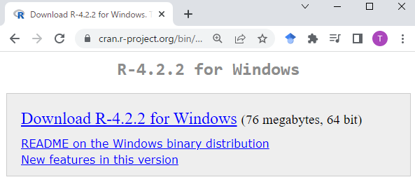
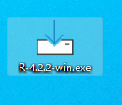
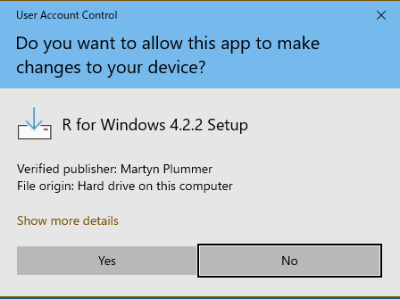
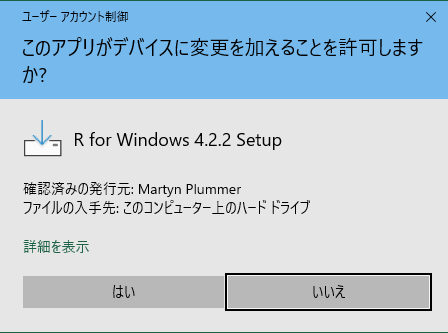
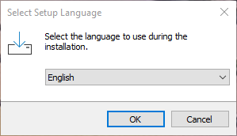
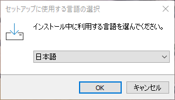
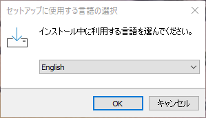
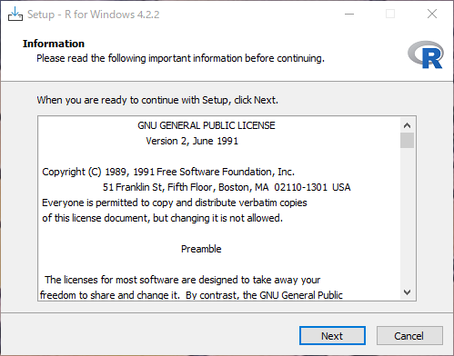
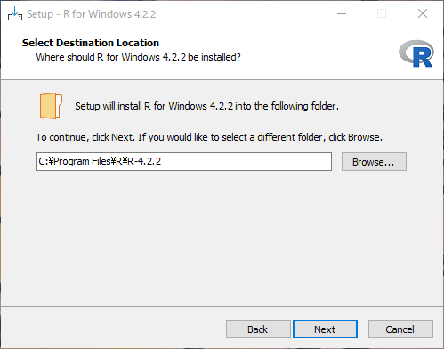
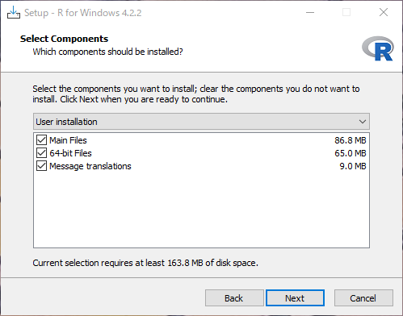

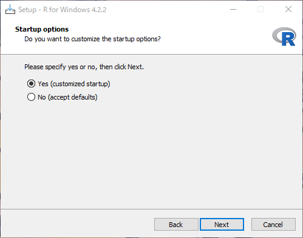
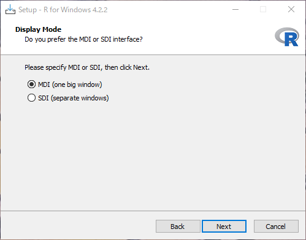
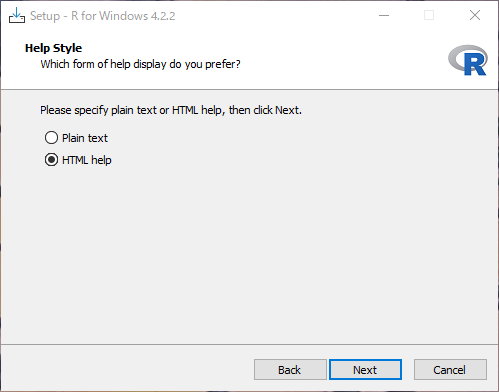
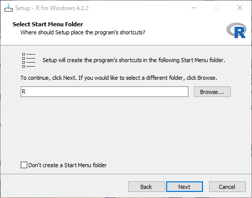
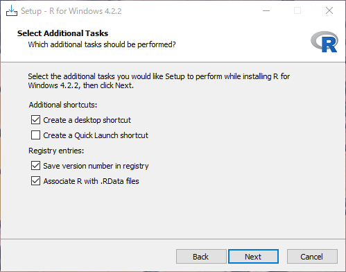
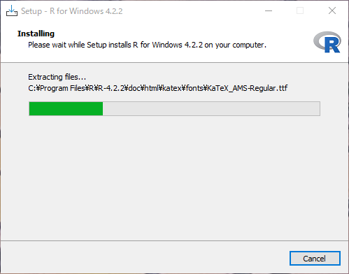
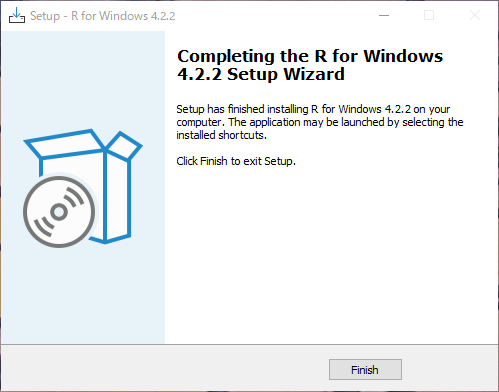
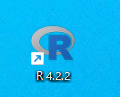
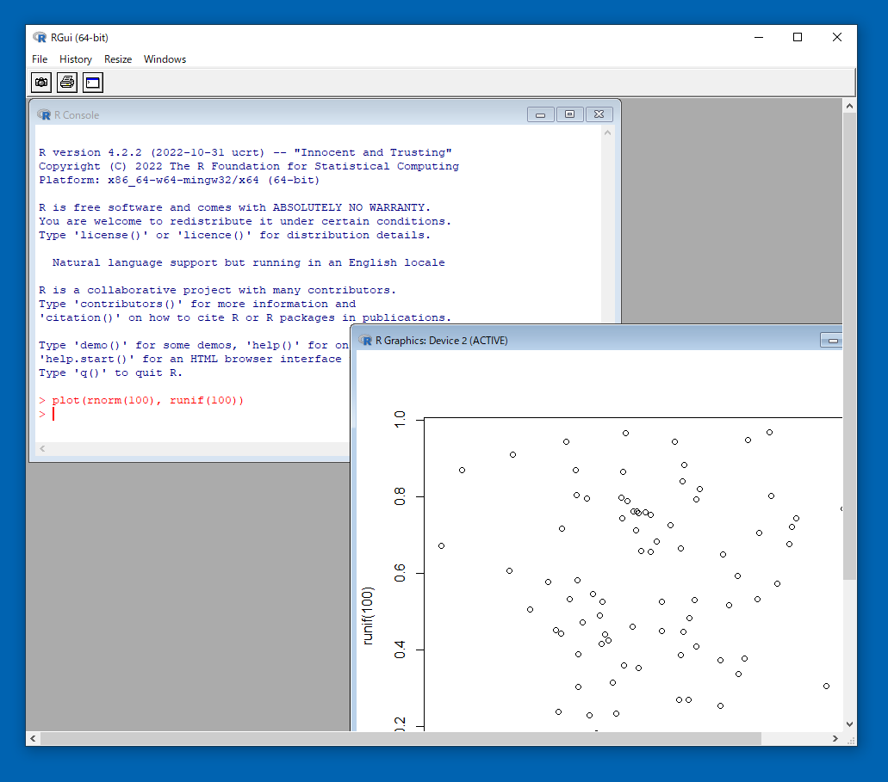
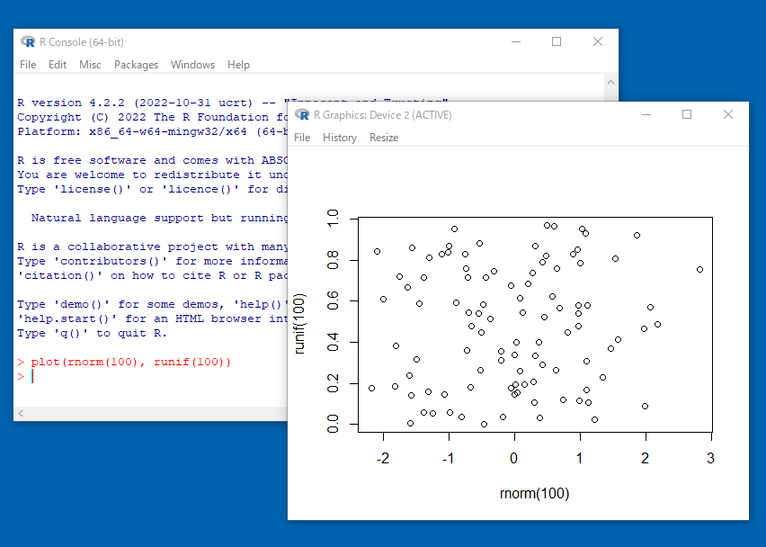

Message translation
  結論としては，とりあえずチェックを入れておき，必要に応じて英語で表示させるという方法が良いかもしれません．
  チェックを入れておくと，エラーメッセージなどを日本語で表示させることができます．
  チェックを入れないと，英語のみの表示です．
  「そら日本語のほうが良いやん」と思うかもしれません．
  ただでもよくわからないエラーメッセージが英語で表示されたら，わけがわからないからです．
  ただ，プログラミングの世界では，英語でのエラーメッセージのほうが便利なことが結構あります．
  それは，エラーメッセージをそのままネットで検索するときです．
  日本語でのエラーメッセージだとネット上の情報が限られています．
  一方，英語でのエラーメッセージで検索すると，原因や対処方法をかなりの確率で知ることができます．
  # https://cell-innovation.nig.ac.jp/SurfWiki/R_errormes_lang.html
  Sys.setenv(LANGUAGE="en")
  Sys.getenv("LANGUAGE")
  Sys.setenv(LANGUAGE="jp")
MDI / SDI
  個人的な好みはSDIですが，好みの問題ですので正直どちらでも結構です．
  MDIは大きな1つのWindowの中に，コンソール(プログラムの入力部分)，グラフ，ヘルプなどが表示されます．
  SDIはコンソール，グラフ，ヘルプが別々のWindowとして表示されます．どちらかといえば，自由度が高いです．
Plain text / HTML help
  個人的な好みはPlain textですが，好みの問題ですので正直どちらでも結構です．
  Plain textはテキストファイルで表示されます．シンプルな作りです．
  HTML helpはヘルプがブラウザ(GoogleChrome等)で表示されます．関連する関数などへのリンクが表示されるので，それらを参照するのは便利です．
その後の設定は，既定値(そのまま)でOKです．
