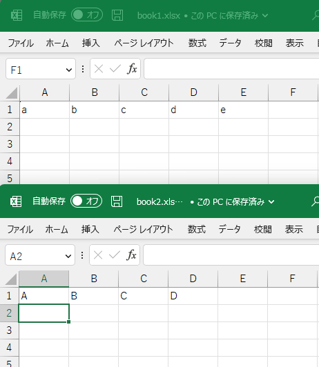
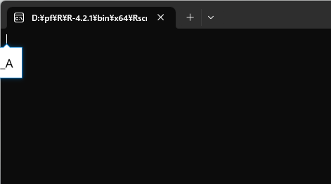
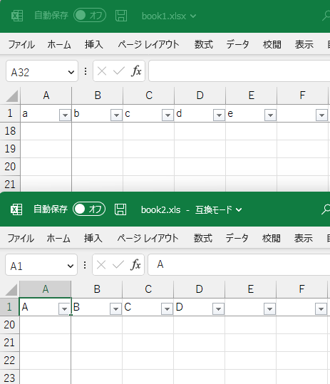

# openxlsxでエクセル操作 {#openxlsx}

Rで解析するときの元データとしてcsv(カンマ区切りのテキスト)やtsv(タブ区切りのテキスト)として使っているが，エクセル形式でデータが提供されることもよくある．
エクセルで開いてからcsvなどに保存し直しても良いが，手作業が面倒である．
どうせなら，エクセルファイルそのものからデータを取得したい．
また，逆にRで分析した結果をデータをエクセル形式で提供したいこともある．
いや，正確には提供したいというか，こっちはそんなことはないのだが，提供される側にそれを求められることがある．

readxlパッケージを使えば簡単にデータの読み書きができるものの，内容は単純なものでcsvをエクセルに貼り付けただけになってしまう．
折角ならエクセルのオートフィルタの設定やウィンドウ枠の固定を使ったり，セルの幅を自動で調整したり，罫線を引いたりもしておきたい．
そんなときには，openxlsxパッケージが便利である．
上記の操作をRから実行できるようにすれば，既存のエクセルのワークブックを開いて，各種操作をして，上書き保存することが自動化できる．
ここでは，そのような技を紹介する．

なお，エクセルのワークブックを操作するパッケージとしてxlsxやexcel.linkなどもあり，類似の機能を提供している．
また，openxlsxの後継としてopenxlsx2があるものの，開発中でありAPI変更の可能性があるらしい．

## 準備

まずは，パッケージをCRANからインストールして，呼び出しておく．


```{r, eval = FALSE}
install.package("openxlsx")
```

```{r, message = FALSE}
library(tidyverse)
library(openxlsx)
  # remotes::install_github("matutosi/pivotea")
library(pivotea)
data(hogwarts)


timetable <- 
  hogwarts %>%
  pivot(row = c("grade", "hour"), col = "wday", value = c("subject", "teacher"), split = "house")


tmp <- fs::file_temp(ext = "xlsx")
openxlsx::write.xlsx(timetable, tmp)
wb <- openxlsx::loadWorkbook(tmp)
  # shell(tmp)
```


## 列幅の変更，オートフィルタの設定，ウィンドウ枠の固定

openxlsxでは，`setColWidths()`で列幅の変更，`addFilter()`でオートフィルタの設定，`freezePane()`ウィンドウ枠の固定ができる．
ワークブック名やシート名などともに，それぞれで設定するべき値を指定する．
列幅の指定では，
なお，openxlsxでは副作用でワークブックの中身を更新するので，関数を適用したあとに，オブジェクトへの代入は不要である．
不要というよりは，正確には代入してはならない．
関数の戻り値が`invisible(0)`であるためだ．

列幅を指定する`setColWidths()`では， `width =  "auto"`とすると，自動的に適切な幅に設定してくれる．
エクセルの列の境界のところでダブルクリックをすると適切な幅にしてくれるのと，同様である．

`setColWidths()`，`addFilter()`，`freezePane()`で各シートでの設定をしたら，
最後に，`saveWorkbook()`でワークブックを保存する．

```{r}
for(sheet in sheets(wb)){
  df <- openxlsx::readWorkbook(wb, sheet)
  openxlsx::setColWidths(wb, sheet, cols = 1:ncol(df), width =  "auto")
  openxlsx::addFilter(wb, sheet, row = 1, cols = 1:ncol(df))
  openxlsx::freezePane(wb, sheet, firstCol = TRUE, firstRow = TRUE)
}
openxlsx::saveWorkbook(wb, tmp, overwrite = TRUE)
  # shell(tmp)
```


列幅の変更・オートフィルタの設定・ウィンドウ枠の固定のいずれもシートごとに作業しなければならない．
これは手作業でもopenxlsxでも同じである．
ただし，手作業の場合はファイルやシートが増えれば増えるほど，面倒くささが増加する．
面倒なだけでなく，作業の間違いも当然発生するだろう．
エクセルでも自動化は可能であるが，それでも手作業は必要である．

openxlsxで自動化した場合でも，もちろんプログラムの実行時間はファイル数やシート数に比例して増加する．
しかし，Rとopenxlsxに作業をしてもらっている間，ユーザ(あなたや私)は別のことに時間を使うことができる．
他の仕事をやっつけるのもよし，ほっと一息をついてコーヒを飲んでもよい．


## 罫線の設定

列幅・オートフィルタ・ウィンドウ枠の3点セットは，データを保存するワークブックであれば，設定しておきたいものなので，自動化と非常に相性が良い．
それ以外にも，特定のところに罫線を引いて見栄えを良くしたいことがある．

例えば，全体的には縦横に細線を，`grade`が変わるところには二重線を引くとする．


```{r}
sty_thn <- openxlsx::createStyle(border = "TopBottomLeftRight", borderStyle = "thin")
sty_dbl <- openxlsx::createStyle(border = "top", borderStyle = "double")
for(sheet in openxlsx::sheets(wb)){
  df <- openxlsx::readWorkbook(wb, sheet)
  new_grade <- 
    seq_along(df$grade)[df$grade != dplyr::lag(df$grade)] %>%
    `[<-`(1, 1) %>%
    `+`(1)
  openxlsx::addStyle(wb, sheet, style = sty_thn, rows = 1:nrow(df), cols = 1:ncol(df), gridExpand = TRUE)
  openxlsx::addStyle(wb, sheet, style = sty_dbl, rows = new_grade , cols = 1:ncol(df), gridExpand = TRUE, stack = TRUE)
}
openxlsx::saveWorkbook(wb, tmp, overwrite = TRUE)
shell(tmp)
```


## ヘッダーとフッターの追加

ヘッダーとフッターを設定するには，`setHeaderFooter()`を使う．
他の関数と同様に，ワークブック，シート番号(シート名)とともに，`header`と`footer`でヘッダーとフッターの内容を指定する．
ヘッダー(フッター)は，`c("left", "center", "right")`のように，左・中央・右のヘッダー(フッター)に入れたい内容を指定する．
このとき，3つとも指定する必要があり，何も入れたくないときには，`c(NA, NA, "right")`のように`NA`とする．
また，エクセルでの作業と同様に，ページ番号やシート名などを入れたいときは，以下の文字列を指定する．
さらに，`evenHeader`と`evenFooter`で偶数ページの，`firstHeader`と`firstFooter`で最初のページのヘッダーとフッターを指定することも可能である．


```
&[Page]  # ページ番号
&[Pages] # 全ページ数
&[Date]  # 現在の日付
&[Time]  # 現在時刻
&[Path]  # ファイルのパス
&[File]  # ファイル名
&[Tab]   # シート名
```

次のように設定して保存すると，エクセルのファイルでもちゃんと設定されている．

```{r}
wb <- openxlsx::loadWorkbook(tmp)
setHeaderFooter(wb, 1, header = c("&[Date]", "ALL HEAD CENTER", "&[Page] / &[Pages]"))
openxlsx::saveWorkbook(wb, tmp, overwrite = TRUE)
  # shell(tmp)
```


## 作業の自動化


## 


## 
xlsxの使用例として，オートフィルタを設定して・ウィンドウ枠を固定する自動化スクリプトを作成した．

### 使用方法   
- 準備：<a href="https://matutosi.github.io/retc/install.html">Rのインストール</a>    
- 準備：<a href="https://gist.githubusercontent.com/matutosi/fe217c7ed934dd242d6798aca846d902/raw/c7b93586db398f801d469bd98a9e764a04a4a8e2/set_autofilter_freezepanel.rsc" download>set_autofilter_freezepanel.rsc</a>
をダウンロード(右クリックして「名前を付けてリンク先を保存」)して，任意のフォルダに保存．   
- 準備：<a href="https://matutosi.github.io/retc/assoc.html">スクリプトの関連付け</a>を参考にして，「.rsc」を「Rscript.exe」に関連付けする(Windowsの場合)．   
   Macの場合は，<a href="https://pc-karuma.net/mac-extension-related-app-change/">Mac - 拡張子に関連付けられているアプリを変更する方法</a>などを参考にしてほしい．   
- set_autofilter_freezepanel.rsc と同じフォルダに，処理したいエクセルのファイルを保存．   
{ width=80% }    
- 実行前のエクセルのファイル   
{ width=40% }    
- set_autofilter_freezepanel.rsc をダブルクリックして実行すると，コマンドのウィンドウでプログラムが実行される．   
{ width=40% }   
プログラムが自動的にエクセルのファイルの1行目のA列からZ列までにオートフィルタを設定し，1行目と1列目でウィンドウ枠を固定する．
複数ファイル・複数シートにも対応している．   
なお，初回実行時は，xlsxパケージのダウンロードのため，少し時間がかかるかもしれない．
2回目以降はファイル数が多すぎなければ，一瞬で処理されるはず．   
実行後のエクセルのファイル   
{ width=40% }   

### スクリプトの内容説明   

```{r eval = FALSE}
  # Package, 準備
if(! "xlsx" %in% installed.packages()[,1]){  # xlsxパッケージ有無の確認
  # パッケージが無い場合
  options(repos = "https://cran.ism.ac.jp/") # ミラーサイトの設定
  install.packages("xlsx")                   # パッケージのインストール
}

  # Functions, 関数
  #   註：xlsxパッケージの関数は返り値の代入がない
  #         副作用でシートなどを操作するため?
  #         参照型を使っているため?
  #   参考：通常のRの関数は，返り値の代入をすることが多い

  # オートフィルタの設定
set_auto_filter <- function(sh){
  # A1からZ1までを設定
  #   もっと多くの列で設定したければ，"A1:Z1"のところを修正する
  xlsx::addAutoFilter(sh, "A1:Z1")
}

  # ウィンドウ枠の固定
set_freeze_panel <- function(sh){
  # 1列目と1行目のウィンドウ枠を固定
  #   固定する場所の変更方法
  #     2行目までを固定したい場合は，引数の2つ目と4つ目を，3にする
  #     3列目までを固定したい場合は，引数の3つ目と5つ目を，4にする
  xlsx::createFreezePane(sh, 2, 2, 2, 2)
}

  # ワークブックごとで設定
set_af_fp <- function(file){
  wb <- xlsx::loadWorkbook(file)   # ワークブックの読み込み
  for(sh in xlsx::getSheets(wb)){  # シートの数だけ繰り返し
    set_auto_filter(sh)            #   オートフィルタの設定
    set_freeze_panel(sh)           #   ウィンドウ枠の固定
  }
  xlsx::saveWorkbook(wb, file)     # ワークブクの保存
}

  # Main, 本体
files <- list.files(pattern = "xls") # ".xls"と"xlsx"の一覧取得
for(file in files){                  # ファイルの数だけ繰り返し
  set_af_fp(file)                    # set_af_fp()の実行
}
```


## ワークブックとシートの読み込み(ボツ?)

エクセルのファイルは，複数のシートから構成されることが多く，複数のシートを束ねたものをワークブックとよぶ．
openxlsxでは，ワークブック全体を読み込むこともできるし，シートを1つだけ読み込むこともできる．

Rのパッケージにはサンプルのデータが入っていることがあり，openxlsxパッケージでは`extdata`ディレクトリにサンプルがあるので，そのデータを使ってみる．
まずは，一覧を取得する

```{r}
files <- 
  fs::path_package("openxlsx", "extdata") %>%
  fs::dir_ls(regexp = "\\.xlsx")
fs::path_file(files)
```

ファイル名だけでは中身がよくわからないが，ここでは6番目のファイルを使う．


```{r}
wb <- 
  files[6] %>%
  openxlsx::loadWorkbook() %>%
  print()
## A Workbook object.
## Worksheets:
##  Sheet 1: "IrisSample"
## (中略)
##  Sheet 2: "testing"
## (中略)
##  Sheet 3: "mtcars"
## (略)
openxlsx::sheets(wb)
```


```{r, echo = FALSE, eval = FALSE}
  # ls("package:fs")
file <- "d:/book1.xlsx"
wb <- openxlsx::loadWorkbook(file)
df <- openxlsx::readWorkbook(wb, 1)
addFilter(wb, 1, row = 1, cols = 1:ncol(df))
freezePane(wb, 1, firstCol = TRUE, firstRow = TRUE)
openxlsx::saveWorkbook(wb, file, overwrite = TRUE)
```


```{r, echo = FALSE, eval = FALSE}
  # ls("package:openxlsx")
  # https://cran.r-project.org/web/packages/openxlsx/index.html
  # https://cran.r-project.org/web/packages/xlsx/index.html

  # https://rdrr.io/cran/openxlsx/man/addFilter.html
  # library("openxlsx")
  # ls("package:openxlsx")
file <- "d:/book1.xlsx"
wb <- openxlsx::loadWorkbook(file)
df <- openxlsx::readWorkbook(wb, 1)
addFilter(wb, 1, row = 1, cols = 1:ncol(df))
freezePane(wb, 1, firstCol = TRUE, firstRow = TRUE)
openxlsx::saveWorkbook(wb, file, overwrite = TRUE)
```
